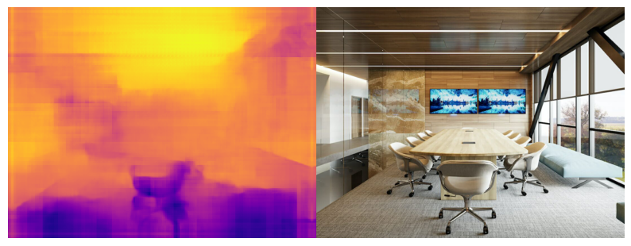

# resnet_depthnet

Monocular depth estimation using resnet18 encoder - decoder model.

# Result

## Todo

1. Add notebook to train with code in ./resnet folder
2. Modify imports in ./resnet folder
3. Refactor model.py code

## Conclusion

Surely the model would perform better if trained for more epochs

